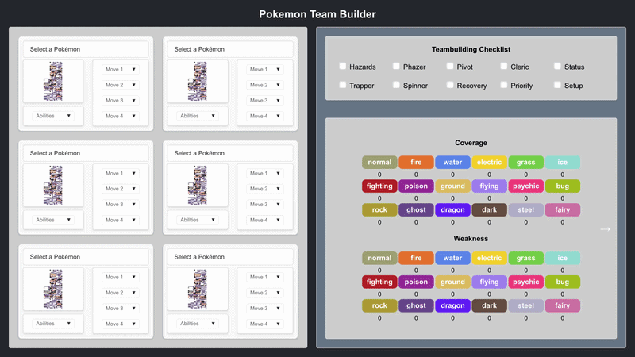
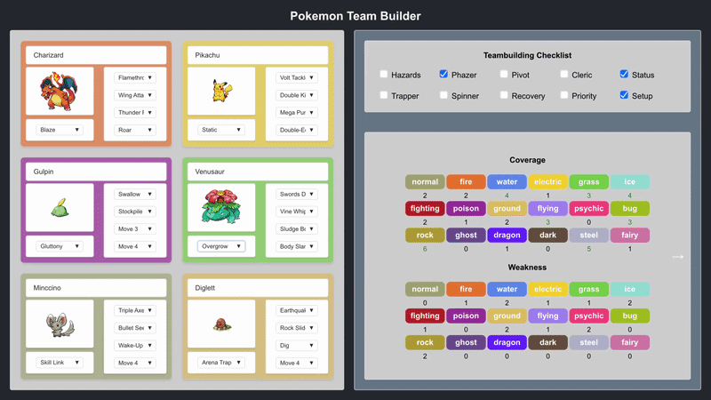

# PokeTeamBuilder

A React-based team builder for Pokémon that integrates with the **PokeAPI** to help construct and analyze competitive teams.

The application allows users to build a full 6-Pokémon team, select abilities and moves, and receive automatic feedback about team structure, weaknesses, and strategic coverage.

---



## Features

### Team Builder
- Create a team of **up to 6 Pokémon**
- Select Pokémon from a dropdown using **live data from PokeAPI**
- Choose **abilities and moves**
- Toggle between **regular and shiny sprites**
- Dynamic **type-colored Pokémon cards**

### Team Utility Checklist
Automatically detects strategic tools within the team based on selected moves:

- Entry hazards
- Hazard removal
- Pivot moves
- Phazing
- Cleric support
- Status spreading
- Trapping
- Recovery
- Priority moves
- Setup moves

When one of these utilities is selected, the corresponding checkbox is marked.

### Team Analysis

#### Type Weakness & Coverage
- **type weaknesses** across the team
- **offensive coverage** based on selected moves

#### Stat Radar Chart
- Displays the **average team stats** using a radar chart:

#### Team Suggestions
Includes a suggestion panel with three candidate Pokémon:

- **Random** — generates three random Pokémon
- **Suggestor** — recommends three Pokémon weighted based on current type weaknesses

Clicking a suggestion card allows assigning that Pokémon to a specific team slot.

---

## Tech Stack

- **React**
- **JavaScript**
- **CSS**
- **PokeAPI** (https://pokeapi.co/)

---

## Running the Project

Clone the repository:

```bash
git clone git@github.com:lzklein/poke-teambuilder.git
cd poke-teambuilder
```

Install dependencies:

```bash
npm install
```

Start the development server:

```bash
npm start
```

The app will run locally at:

```
http://localhost:3000
```

---

## Data Source

Pokémon data is fetched from the **PokeAPI**:

https://pokeapi.co/

This includes:
- Pokémon sprites
- Typing
- Base stats
- Abilities
- Move data

---

## Notes

- All calculations (team weaknesses, coverage, suggestions) are performed **client-side**.
- The UI dynamically adapts to Pokémon types with color-coded cards.
- Designed as a **frontend-only application** using live API data.

---

## Future Improvements

Possible enhancements include:

- Team export / import
- Damage calculator integration
- Competitive role tagging

---

## Demo


